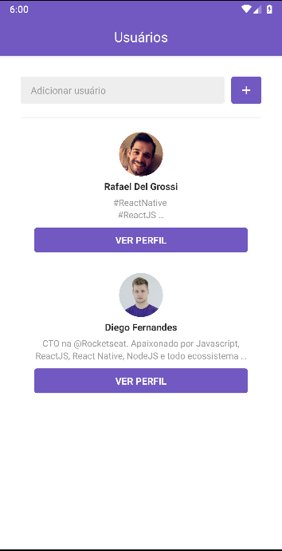
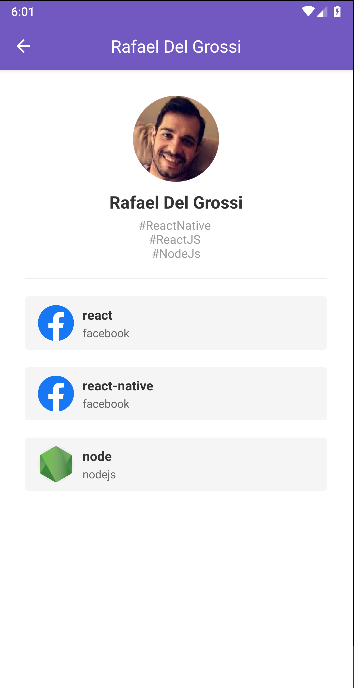

<h1 align="center">
    GitHub Favorites App
</h1>

<h4 align="center">
  APP that list a user's favorites repositories
</h4>
<p align="center">
  

  
</p>

<p align="center">
  <a href="#rocket-technologies">Technologies</a>&nbsp;&nbsp;&nbsp;|&nbsp;&nbsp;&nbsp;
  <a href="#information_source-how-to-use">How To Use</a>&nbsp;&nbsp;&nbsp;
</p>


<p align="center">
  
  
</p>

## :rocket: Technologies

This project was developed at the [RocketSeat GoStack Bootcamp](https://rocketseat.com.br/bootcamp) with the following technologies:

-  [React Native](https://reactnative.dev/)
-  [React Navigation](https://reactnavigation.org/)
-  [Axios](https://github.com/axios/axios)
-  [styled-components](https://www.styled-components.com/)
-  [VS Code][vc] with [EditorConfig][vceditconfig] and [ESLint][vceslint]

## :information_source: How To Use

To clone and run this application, you'll need [Git](https://git-scm.com), [Node.js v10.16][nodejs] or higher + [Yarn v1.13][yarn] or higher installed on your computer. From your command line:

```bash
# Clone this repository
$ git clone https://github.com/rafadevx/github-rn

# Go into the repository
$ cd github-rn

# Install dependencies
$ yarn install

# Run the app (iOS)
$ react-native run-ios --simulator="iPhone XS Max"

# Run the app (Android)
$ react-native run-android
```


---

💻 Made by Rafael Del Grossi 💬 [Get in touch!](www.linkedin.com/in/rafael-del-grossi-b9063831)

[nodejs]: https://nodejs.org/
[yarn]: https://yarnpkg.com/
[vc]: https://code.visualstudio.com/
[vceditconfig]: https://marketplace.visualstudio.com/items?itemName=EditorConfig.EditorConfig
[vceslint]: https://marketplace.visualstudio.com/items?itemName=dbaeumer.vscode-eslint
